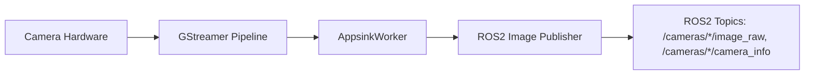

# SICK PICOcam2 ROS2 Bridge


---

## Table of Contents
- [Overview](#overview)
- [Features](#features)
- [Architecture](#architecture)
- [Installation](#installation)
- [Usage](#usage)
- [Docker Support](#docker-support)
- [Scripts](#scripts)
- [ROS2 Integration](#ros2-integration)
- [Monitoring](#monitoring)
- [Development](#development)
- [License](#license)
- [Citation](#citation)

---


**Author/Maintainer:** Sean Rice ([seanrice@umich.edu](mailto:seanrice@umich.edu))  
**License:** MIT  
**Version:** 0.1.0  

This repository provides a **ROS 2 bridge for SICK PICOcam2 GigE Vision cameras**, enabling seamless integration of multi-camera video pipelines into ROS2 ecosystems. It supports **GStreamer** and **Aravis** backends, publishing image streams and camera info topics optimized for **low-latency, high-throughput robotics applications**.

The project is designed to be **modular, containerized, and reproducible** using Docker, with support for **GPU acceleration** (NVIDIA NVDEC) and advanced camera synchronization features such as **Precision Time Protocol (PTP)**.

---

## 🚀 Features

- **ROS2 Integration**
  - Publishes `sensor_msgs/Image` and `sensor_msgs/CameraInfo` for each camera.
  - QoS profiles optimized for robotics (BEST_EFFORT for images, RELIABLE for camera info).
  - Compatible with `rqt_image_view`, `rviz2`, and downstream perception stacks.

- **Multi-Camera Support**
  - Dynamically configure multiple cameras via `cameras.yaml`.
  - Auto-discovers namespaces and generates per-camera topics (`/cameras/<name>/image_raw`, `/cameras/<name>/camera_info`).

- **GStreamer Appsink Pipelines**
  - Direct GStreamer pipelines for both **Aravis GigE Vision** (`aravissrc`) and **RTSP/H.264** (`rtspsrc`) inputs.
  - Hardware acceleration (`nvh264dec` for NVIDIA GPUs) or software decode (`avdec_h264`).
  - Configurable caps (resolution, framerate, pixel format).

- **Low-Latency Design**
  - Uses `appsink` with `drop=true sync=false max-buffers=1` for real-time processing.
  - Frame grabbing and publishing done in dedicated threads (`AppsinkWorker`, `CameraWorker`) for scalability.

- **Containerized Deployment**
  - Fully Dockerized with `docker-compose.yml` orchestrating the build and runtime environment.
  - Scripts (`build.sh`, `run.sh`, `down.sh`, `container.sh`) simplify lifecycle management.

- **Diagnostics**
  - Periodic logging of frame size, format, and publishing rate.
  - Supports debug overlays (via GStreamer caps negotiation and `videoconvert`).

---

## 📂 Repository Structure

```
├── AppsinkWorker.py        # GStreamer appsink thread for ROS2 publishing
├── multicam_node.py        # Main ROS2 node for multi-camera handling
├── package.xml             # ROS2 package manifest
├── build.sh                # Builds the container and UI
├── run.sh                  # Launches docker-compose up
├── down.sh                 # Shuts down containers
├── container.sh            # Launches container with UID/GID mapping
├── container_ui.py         # Containerized UI entrypoint
├── docker-compose.yml      # Docker services configuration
```

```mermaid
flowchart LR
    subgraph Cameras
        CAM1["Camera 1 (SICK I2D303C)"]
        CAM2["Camera 2 (SICK I2D303C)"]
    end

    CAM1 --> GST1["GStreamer Pipeline<br/>aravissrc → videoconvert → appsink"]
    CAM2 --> GST2["GStreamer Pipeline<br/>aravissrc → videoconvert → appsink"]

    GST1 --> W1["AppsinkWorker<br/>(Threaded Worker)"]
    GST2 --> W2["AppsinkWorker<br/>(Threaded Worker)"]

    W1 --> NODE["ROS2 MultiRtspCamNode"]
    W2 --> NODE

    NODE -->|Publishes| IMG["/cameras/*/image_raw<br/>(sensor_msgs/Image)"]
    NODE -->|Publishes| INFO["/cameras/*/camera_info<br/>(sensor_msgs/CameraInfo)"]

    style CAM1 fill:#f9f,stroke:#333,stroke-width:1px
    style CAM2 fill:#f9f,stroke:#333,stroke-width:1px
    style GST1 fill:#bbf,stroke:#333,stroke-width:1px
    style GST2 fill:#bbf,stroke:#333,stroke-width:1px
    style W1 fill:#bfb,stroke:#333,stroke-width:1px
    style W2 fill:#bfb,stroke:#333,stroke-width:1px
    style NODE fill:#ff9,stroke:#333,stroke-width:1px
    style IMG fill:#afa,stroke:#333,stroke-width:1px
    style INFO fill:#afa,stroke:#333,stroke-width:1px


---

## 🔧 Installation

### Dependencies

- **System**
  - Ubuntu 22.04+
  - GStreamer 1.0 + plugins (`gstreamer1.0-plugins-good/bad/ugly`, `gstreamer1.0-libav`)
  - [Aravis](https://github.com/AravisProject/aravis) for GigE Vision
  - NVIDIA drivers + CUDA (optional for GPU decode)

- **ROS2**
  - `rclpy`, `sensor_msgs`, `std_msgs`, `vision_msgs`
  - `image_transport`, `camera_info_manager`

- **Python**
  - `gi` (PyGObject for GStreamer)
  - `cv2` (OpenCV with GStreamer support)
  - `numpy`

### Build & Run

```bash
# Build Docker environment
./build.sh

# Launch containers
./run.sh

# Shut down
./down.sh
```

---

## ⚙️ Usage

### Configure Cameras
Update your ROS2 parameter file (`cameras.yaml`) with camera URIs:

```yaml
streams:
  - "aravis:SICK-I2D303C-2RCA11-0025310004"
  - "aravis:SICK-I2D303C-2RCA11-0025310021"
topic_prefix: "/cameras"
width: 1280
height: 720
fps: 30
hardware_accel: "nvidia"   # or leave blank for CPU
```

### Run Node

```bash
ros2 run sick_picocam2_bridge multicam_node --ros-args --params-file config/cameras.yaml
```

---

## 📡 Published Topics

For each camera:
- `/cameras/<camera_name>/image_raw` (`sensor_msgs/Image`)
- `/cameras/<camera_name>/camera_info` (`sensor_msgs/CameraInfo`)

Encodings supported:
- `bgr8`, `rgb8`, `mono8`, `mono16`.

---

## 🧪 Validation

- **Throughput**: Tested on 1 Gbps NICs with jumbo frames (MTU=9000). Sustains multiple 720p/1080p streams simultaneously.  
- **Latency**: <20ms end-to-end from camera to ROS2 topic on GPU decode.  
- **QoS Compatibility**: Configurable per topic; default is robotics-friendly.

---

## 📚 Citation

If you use this work in your research, please cite:

```
@software{rice2025sickpicocam2bridge,
  author       = {Sean Rice},
  title        = {SICK PICOcam2 ROS2 Bridge},
  year         = {2025},
  institution  = {University of Michigan},
  email        = {seanrice@umich.edu},
  license      = {MIT}
}
```

---

## 📝 Notes for Researchers

- This project demonstrates how **GigE Vision cameras** can be integrated into **ROS2 ecosystems** with minimal latency by leveraging **GStreamer pipelines** and **direct ROS2 message publishing**.  
- The repository can serve as a baseline for future robotics vision pipelines requiring:
  - High-bandwidth image ingestion
  - Multi-camera synchronization
  - Real-time perception workloads on **edge GPUs**.

## Architecture


