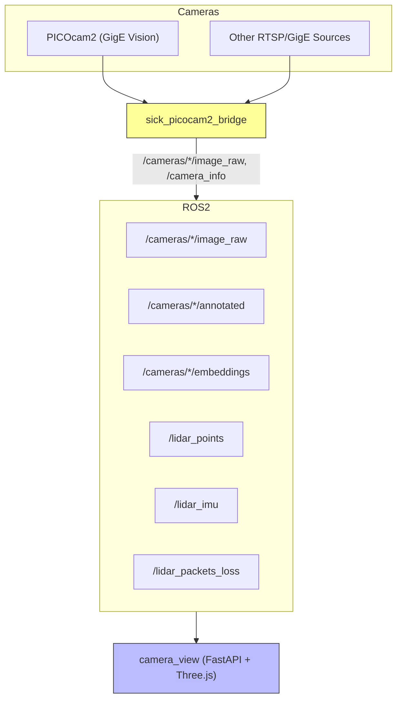

# Multi-Camera ROS2 Ecosystem

---

## Table of Contents
- [Overview](#overview)
- [Modules](#modules)
- [Architecture](#architecture)
- [Installation](#installation)
- [Usage](#usage)
- [Docker Support](#docker-support)
- [Monitoring](#monitoring)
- [Development](#development)
- [License](#license)
- [Citation](#citation)

---


**Author/Maintainer:** Sean Rice ([seanrice@umich.edu](mailto:seanrice@umich.edu))  
**License:** Creative Commons Attribution�NonCommercial 4.0 International (CC BY-NC 4.0)  
**Version:** 0.1.0

This repository provides a **modular multi-camera + LiDAR ROS2 ecosystem**, designed for **low-latency, high-throughput robotics applications**. It includes:

- **SICK PICOcam2 ROS2 Bridge** � a GStreamer/Aravis-powered ROS2 bridge for GigE Vision cameras.  
- **Camera View Dashboard (`camera_view`)** � a FastAPI + WebSocket + Three.js UI for live camera/LiDAR/IMU visualization.

Both modules are container-friendly and tuned for GPU acceleration.

---

## ?? Modules

### SICK PICOcam2 ROS2 Bridge
- ROS2 bridge for **SICK PICOcam2** GigE Vision cameras.
- Publishes `sensor_msgs/Image` and `sensor_msgs/CameraInfo` with robotics-friendly QoS.
- GStreamer/Aravis pipelines with optional **NVDEC** HW decode.
- PTP-friendly and scalable to many cameras.
- **Docs:** ? [catkin_ws/src/sick_picocam2_bridge/Readme.md](catkin_ws/src/sick_picocam2_bridge/Readme.md)

---

### Camera View Dashboard (`camera_view`)
- Web dashboard with tabs for **Raw**, **Annotated**, **Detections**, **Embeddings**, **LiDAR**, and **Cameras**.
- Streams DINOV3 embeddings (JSON), shows detections, and renders 3D LiDAR + IMU in **WebGPU/WebGL**.
- HTTPS/WSS by default, configurable cert/key.
- **Docs:** ? [catkin_ws/src/camera_view/Readme.md](catkin_ws/src/camera_view/Readme.md)

---

## ??? Architecture



---

## ?? Installation

### Dependencies
- Ubuntu 22.04+
- ROS2 Humble+
- SSL Certificate (required for web viewer)
- GStreamer + plugins (`good`, `bad`, `ugly`, `libav`)
- NVIDIA drivers (optional for NVDEC)
- Python 3.12 with:
  - `fastapi`, `uvicorn`, `opencv-python`, `numpy`, `transforms3d`

### Build
```bash
cd ~/multicamera_ros2/catkin_ws
source /opt/ros/kilted/setup.bash && \
             colcon build --cmake-args -DCMAKE_BUILD_TYPE=RelWithDebInfo \
                          --merge-install \
                          --event-handlers console_direct+

source install/setup.bash
```

---

## ?? Usage

### Launch the PICOcam2 Bridge
Use the launch file (not `ros2 run`):
```bash
ros2 launch sick_picocam2_bridge multicam.launch.py --ros-args --params-file config/cameras.yaml
```

### Launch the Camera View Dashboard
The dashboard is also launched via ROS2 launch:
```bash
ros2 launch camera_view webstream_launch.py
```
Then browse to:
```
https://<host>:1080/
```

**TLS**: By default the package uses embedded cert/key at `camera_view/ssl/cert.pem` and `camera_view/ssl/key.pem`.  
You may override by mounting replacement files or setting env vars `WVW_CERT` and `WVW_KEY`.

**Recording root**: Set `RECORD_ROOT` to control where sessions are stored (default shown in Docker section).

---

## ?? Docker Support

A compose layout with **GPU**, **host networking**, **X11**, and a **health-gated startup** is provided. 
To utilize this docker container, run the commands below. 

```bash
docker compose build
docker compose up
```

To run individual containers

```bash
docker compose up base
docker compose up camera_view
```
> Notes  
> � The `base` service builds the ROS/driver image and exposes a healthcheck so `camera_view` waits until ROS is up.  
> � `user: "${UID}:${GID}"` preserves host file perms inside containers.  
> � `RECORD_ROOT` is bound to `./data/recordings` on the host.  
> � The TLS key is overridden via a bind mount; the packaged cert/key are used otherwise.

---

## ?? Monitoring

- **ROS2 logs** from the bridge for throughput/diagnostics.
- **Web dashboard** (FastAPI + WebSockets) at `https://<host>:1080/`.
- **LiDAR** viewer shows IMU orientation and packet-loss overlay in real time.

---

## ????? Development

- Build with `colcon`, launch with the provided launch files.  
- See per-module docs for configuration, parameters, and advanced usage:
  - [PICOcam2 Bridge README](catkin_ws/src/sick_picocam2_bridge/Readme.md)
  - [Camera View README](catkin_ws/src/camera_view/Readme.md)

---

## ?? Citation

If you use this work in your research, please cite:

```
@software{rice2025multicamera,
  author       = {Sean Rice},
  title        = {Multi-Camera ROS2 Ecosystem},
  year         = {2025},
  institution  = {University of Michigan},
  email        = {seanrice@umich.edu},
  license      = {MIT}
}
```
