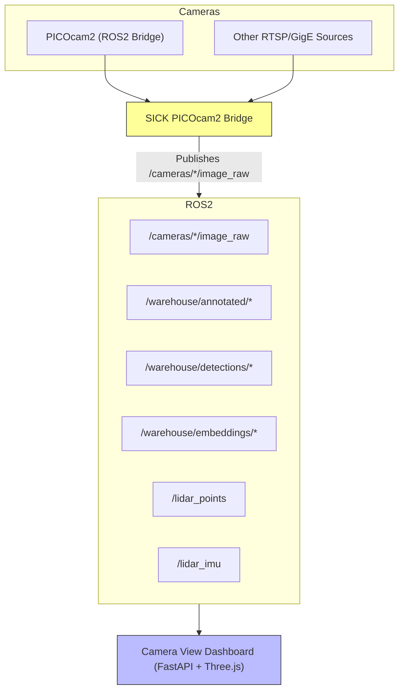

# Multi-Camera ROS2 Ecosystem

---

## Table of Contents
- [Overview](#overview)
- [Modules](#modules)
- [Architecture](#architecture)
- [Installation](#installation)
- [Usage](#usage)
- [Docker Support](#docker-support)
- [Monitoring](#monitoring)
- [Development](#development)
- [License](#license)
- [Citation](#citation)

---

  
  
  
  
  
  

**Author/Maintainer:** Sean Rice ([seanrice@umich.edu](mailto:seanrice@umich.edu))  
**License:** MIT  
**Version:** 0.1.0  

This repository provides a **modular multi-camera + LiDAR ROS2 ecosystem**, designed for **low-latency, high-throughput robotics applications**. It includes:

- A **ROS2 bridge** for **SICK PICOcam2 GigE Vision cameras**, optimized with GStreamer pipelines and ROS2 QoS profiles.  
- A **web-based dashboard** (`camera_view`) built on **FastAPI + Three.js**, enabling real-time visualization of multiple camera feeds, annotated detections, DINOV3 embeddings, and LiDAR/IMU streams.  

Both modules are fully containerized with Docker support and designed for reproducibility on GPU-enabled robotics platforms.

---

## ?? Modules

### [SICK PICOcam2 ROS2 Bridge](catkin_ws/src/sick_picocam2_bridge/Readme.md)
- ROS2 bridge for **SICK PICOcam2 GigE Vision** cameras.  
- Publishes `sensor_msgs/Image` and `sensor_msgs/CameraInfo`.  
- Supports GStreamer/Aravis pipelines with NVIDIA NVDEC hardware acceleration.  
- Optimized for PTP synchronization and low-latency multi-camera streaming.

---

### [Camera View Dashboard (`camera_view`)](catkin_ws/src/camera_view/Readme.md)
- **Web UI** for monitoring camera feeds, detections, embeddings, and LiDAR.  
- FastAPI backend with WebSocket live streaming.  
- Interactive **Three.js/WebGPU point cloud viewer** for LiDAR + IMU orientation.  
- Tabbed interface for raw/annotated streams, detections, embeddings, stats, and camera management.  

---

## ??? Architecture



---

## ?? Installation

### Dependencies
- Ubuntu 22.04+
- ROS2 Humble+
- GStreamer + plugins (`good`, `bad`, `ugly`, `libav`)
- Python 3.10+ with:
  - `fastapi`, `uvicorn`, `opencv-python`, `numpy`, `transforms3d`

### Build
```bash
cd ~/multicamera_ros2/catkin_ws
colcon build
source install/setup.bash
```

---

## ?? Usage

- Launch **PICOcam2 ROS2 Bridge**:
  ```bash
  ros2 run sick_picocam2_bridge multicam_node --ros-args --params-file config/cameras.yaml
  ```

- Launch **Camera View Dashboard**:
  ```bash
  ros2 run camera_view camera_view
  ```

Then open:
```
https://<host>:1080/
```

---

## ?? Docker Support

Both modules provide Dockerfiles and compose services.  
See individual module READMEs for details:  
- [PICOcam2 Bridge README](catkin_ws/src/sick_picocam2_bridge/Readme.md)  
- [Camera View README](catkin_ws/src/camera_view/Readme.md)  

---

## ?? Monitoring

- ROS2 logs for camera pipelines.  
- Web UI (FastAPI + WebSocket) for dashboard monitoring.  
- LiDAR visualization with live IMU and packet loss stats.  

---

## ?? Citation

If you use this work in your research, please cite:

```
@software{rice2025multicamera,
  author       = {Sean Rice},
  title        = {Multi-Camera ROS2 Ecosystem},
  year         = {2025},
  institution  = {University of Michigan},
  email        = {seanrice@umich.edu},
  license      = {MIT}
}
```
